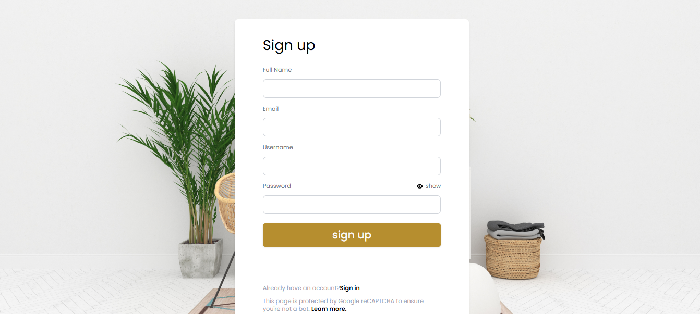
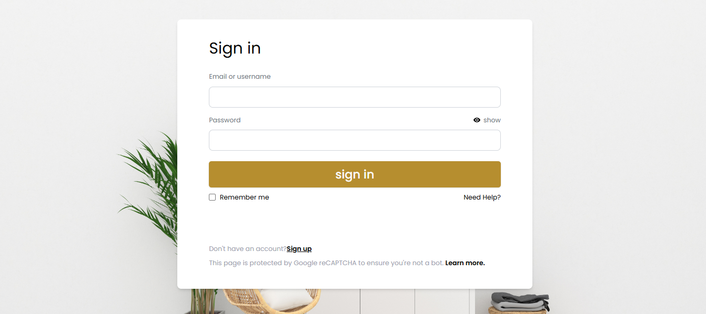
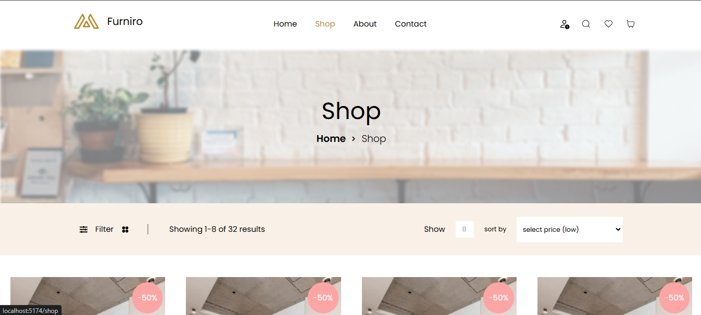
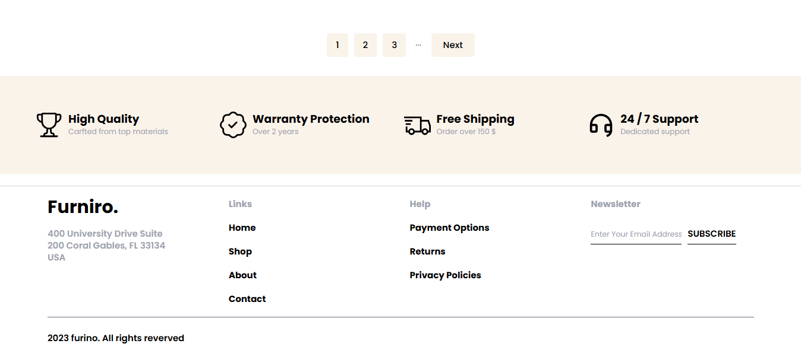
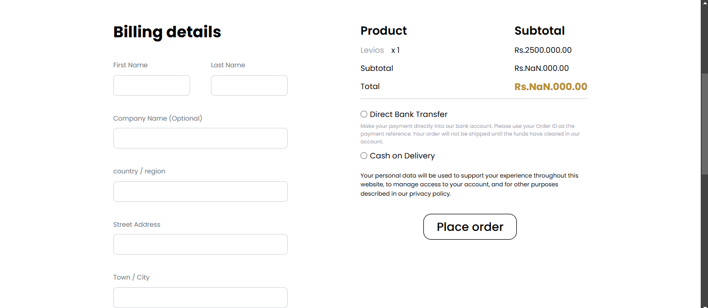
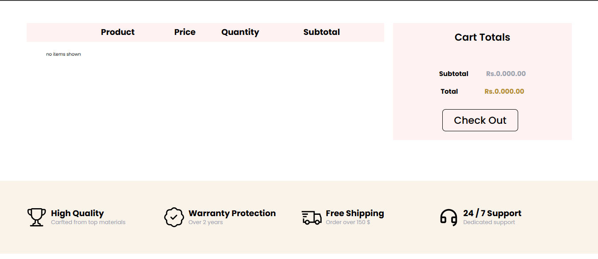
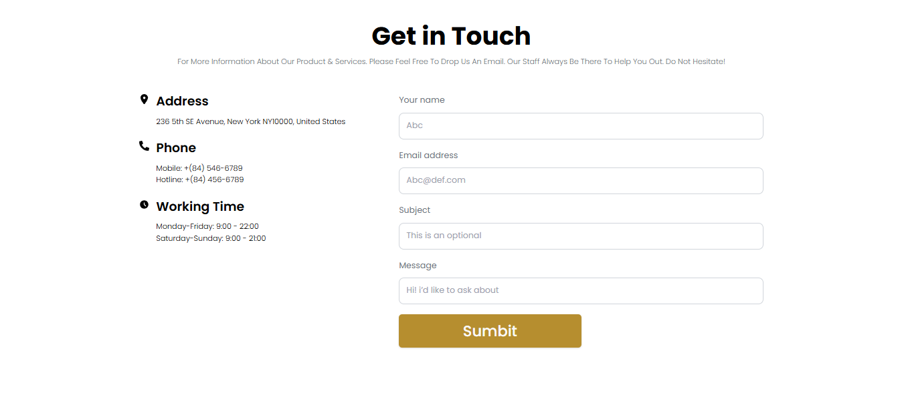

# Furniro.

<div id="top"></div>


<!-- PROJECT LOGO -->
<div align="center">
<br>
<a href="">
    
  </a>
<br>
<br>

  <p align="center">
  <a href="#">View Demo</a>
    ·
    <a href="https://github.com/MoazElsayedMohamed/Furniro/issues">Report Bug</a>
  </p>
</div>

<!-- TABLE OF CONTENTS -->
<details>
  <summary>Table of Contents</summary>
  <ol>
    <li>
      <a href="#about-the-project">About The Project</a>
      <ul>
        <li><a href="#features">Features</a></li>
        <li><a href="#built-with">Built With</a></li>
        <li><a href="#users">Users</a></li>
      </ul>
    </li>
    <li>
      <a href="#getting-started">Getting Started</a>
      <ul>
        <li><a href="#installation">Installation</a></li>
        <li><a href="#ports">Ports</a></li>
      </ul>
    </li>
    <li><a href="#contributing">Contributing</a></li>
  </ol>
</details>

<!-- ABOUT THE PROJECT -->

## About The Project

An E-commerce web application used for buying furniture thing like chairs ...etc. this e-commerce has been made with authentication to be used with signing in only.

.png>)

### Features

- Register
  
- Login
  
- Home Page
  .png>)
  .png>)
  .png>)
  .png>)
- Shop
  
  
- Single Product
  .png>)
  .png>)
- Checkout
  
- Cart
  
- Contact
  

### Built With

- React
- Strapi
- Vite
- React Query

<p align="right">(<a href="#top">back to top</a>)</p>

---

### users

| Email                     | Password |
| ------------------------- | -------- |
| <moazelsayed12@gmail.com> | 12345678 |

<!--
#### Validation

- **Email validation**: As per **RFC2822** standards.
- **Email authentication**: Through email provider.
- **Password validation**: The password must be more than **8** characters.

<p align="right">(<a href="#top">back to top</a>)</p> -->

<!-- GETTING STARTED -->

## Getting Started

This project require some perquisites and dependencies to be installed, you can find the instructions below

<!-- This project require some perquisites and dependencies to be installed, you can view it online using this [demo](https://the-wild-oasis-cbq1b8hzv-abdrahmansoltan.vercel.app/). or you can find the instructions below: -->

> To get a local copy, follow these simple steps :

### Installation

#### installing Locally

1. Clone the repo

   ```sh
   git clone https://github.com/MoazElsayedMohamed/Furniro
   ```

2. go to project folder

   ```sh
   cd furniro
   ```

3. install dependencies

   ```bash
   npm install
   ```

4. Run vite development server

   ```sh
   npm run dev
   ```

---

### Ports

- FrontEnd Development Server runs on port `5173`

<p align="right">(<a href="#top">back to top</a>)</p>

---

<!-- CONTRIBUTING -->

## Contributing

Contributions are what make the open source community such an amazing place to learn, inspire, and create. Any contributions you make are **greatly appreciated**.

If you have a suggestion that would make this better, please fork the repo and create a pull request. You can also simply open an issue with the tag "enhancement".
Don't forget to give the project a star! Thanks again!

1. Fork the Project
2. Create your Feature Branch (`git checkout -b feature/AmazingFeature`)
3. Commit your Changes (`git commit -m 'Add some AmazingFeature'`)
4. Push to the Branch (`git push origin feature/AmazingFeature`)
5. Open a Pull Request

<p align="right">(<a href="#top">back to top</a>)</p>
